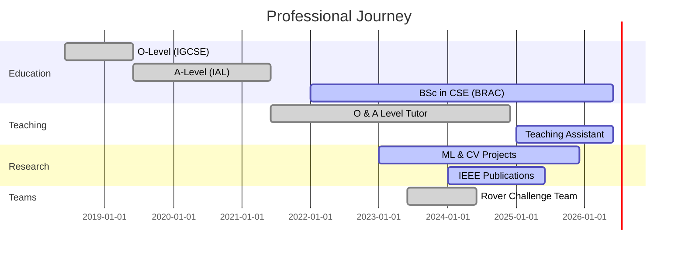
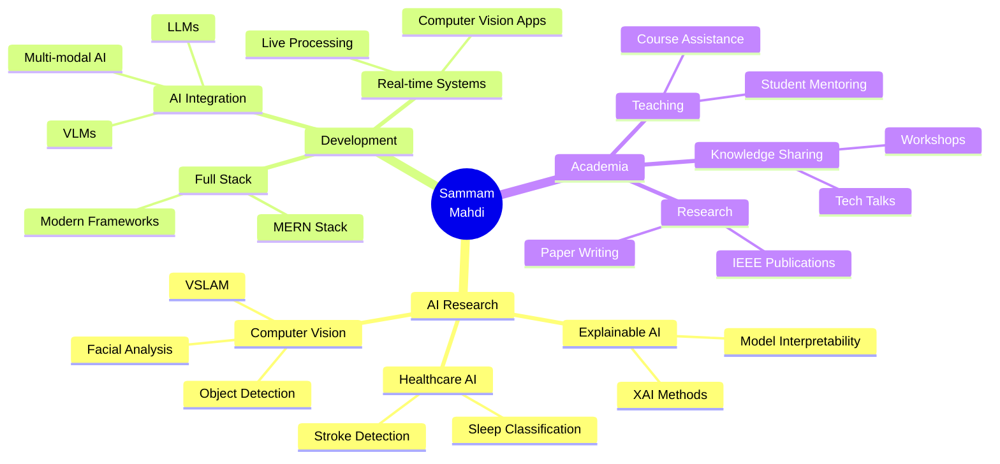

<div align="center">


<a href="https://git.io/typing-svg"></a>

<br/>

[](https://linkedin.com/in/yourprofile)
[](mailto:sammam.mahdi@g.bracu.ac.bd)
[](https://github.com/yourusername)
[](https://yourportfolio.com)


</div>

<br/>


##  About Me


```python
class SammamMahdi:
    def __init__(self):
        self.username = "sammam-mahdi"
        self.location = "Dhaka, Bangladesh 🇧🇩"
        self.education = {
            "university": "BRAC University",
            "major": "Computer Science",
            "cgpa": "3.90/4.00",
            "status": "Undergraduate"
        }
        self.role = "AI Researcher & Full Stack Developer"
        self.passions = [
            "Machine Learning 🤖",
            "Computer Vision 👁️",
            "Explainable AI 🔍",
            "Healthcare AI 🏥"
        ]
        
    def current_work(self):
        return {
            "research": "Healthcare AI & XAI",
            "teaching": "TA @ BRAC University CSE",
            "building": "AI-powered Solutions",
            "publishing": "IEEE Conferences & Journals"
        }
    
    def say_hi(self):
        print("Thanks for dropping by! Let's build something amazing together!")

me = SammamMahdi()
me.say_hi()
```

<br/>

- 🔭 Currently working on **Healthcare AI & Computer Vision Projects**
- 🌱 Learning **Advanced LLMs, VLMs & Multi-modal AI**
- 👯 Looking to collaborate on **AI Research & Open Source Projects**
- 💬 Ask me about **ML, AI, Computer Vision, Web Development**
- 📫 Reach me at **sammam.mahdi@g.bracu.ac.bd**
- ⚡ Fun fact: **Speed Cuber 🎲 & Math Olympiad Participant 🧮**


##  Skills & Technologies

### 👨‍💻 Programming Languages

<p align="center">
  <a href="https://www.python.org" target="_blank">
    
  </a>
  <a href="https://www.java.com" target="_blank">
    
  </a>
  <a href="https://developer.mozilla.org/en-US/docs/Web/JavaScript" target="_blank">
    
  </a>
  <a href="https://www.w3schools.com/cpp/" target="_blank">
    
  </a>
  <a href="https://www.cprogramming.com/" target="_blank">
    
  </a>
  <a href="https://www.typescriptlang.org/" target="_blank">
    
  </a>
</p>

<div align="center">

| Language | Proficiency | Level |
|----------|-------------|-------|
|  Python |  | Expert |
|  Java |  | Advanced |
|  JavaScript |  | Advanced |
|  C++ |  | Advanced |

</div>

### 🌐 Web Development

<p align="center">
  <a href="https://reactjs.org/" target="_blank">
    
  </a>
  <a href="https://nodejs.org" target="_blank">
    
  </a>
  <a href="https://expressjs.com" target="_blank">
    
  </a>
  <a href="https://www.mongodb.com/" target="_blank">
    
  </a>
  <a href="https://vitejs.dev/" target="_blank">
    
  </a>
  <a href="https://www.php.net" target="_blank">
    
  </a>
  <a href="https://www.mysql.com/" target="_blank">
    
  </a>
</p>

<div align="center">

| Technology | Proficiency |
|------------|-------------|
|  MERN Stack |  |
|  Vite |  |
|  TypeScript |  |
|  PHP |  |
|  MySQL |  |

</div>

### 🤖 AI/ML & Data Science

<p align="center">
  <a href="https://pytorch.org/" target="_blank">
    
  </a>
  <a href="https://www.tensorflow.org" target="_blank">
    
  </a>
  <a href="https://scikit-learn.org/" target="_blank">
    
  </a>
  <a href="https://opencv.org/" target="_blank">
    
  </a>
  <a href="https://pandas.pydata.org/" target="_blank">
    
  </a>
  <a href="https://numpy.org/" target="_blank">
    
  </a>
</p>

<br/>

<div align="center">

**🎯 Core Expertise**

<table>
<tr>
<td align="center" width="140" height="112.43">

<br />Machine Learning
</td>
<td align="center" width="140" height="112.43">

<br />Computer Vision
</td>
<td align="center" width="140" height="112.43">

<br />Explainable AI
</td>
<td align="center" width="140" height="112.43">

<br />LLM & VLM
</td>
<td align="center" width="140" height="112.43">

<br />Healthcare AI
</td>
</tr>
</table>

| Specialization | Proficiency |
|----------------|-------------|
| 🏥 Applied AI in Healthcare |  |
| 🔍 Early Detection Systems |  |
| 🧠 Stroke Diagnosis |  |
| 📝 Paper Writing (LaTeX) |  |

</div>


## 📊 GitHub Analytics

<div align="center">
  
  
</div>

<div align="center">
  
  
</div>

<br/>

<div align="center">
  
</div>

<br/>

### 📈 Contribution Graph

<div align="center">
  
</div>

<br/>

### 🔥 GitHub Metrics

<p align="center">
  
</p>


## 📝 Research Publications

<div align="center">

###  IEEE Publications

</div>

<details open>
<summary><b>📚 Journal Article (2025)</b></summary>
<br>

> **"Optimizing Stroke Recognition With MediaPipe and Machine Learning: An Explainable AI Approach for Facial Landmark Analysis"**
> 
> 
> 
> 
> 
> 🔗 DOI: [10.1109/ACCESS.2025.3550577](https://doi.org/10.1109/ACCESS.2025.3550577)
> 
> **Key Focus Areas:**
> - ✅ Explainable AI (XAI)
> - ✅ MediaPipe Integration
> - ✅ Stroke Detection & Recognition
> - ✅ Facial Landmark Analysis
> - ✅ Machine Learning Classification

</details>

<details>
<summary><b>📄 Conference Papers (2024)</b></summary>
<br>

> **"Improved Photoplethysmography-Based Four-Stage Sleep Classification with Explainable AI-Driven Machine Learning"**
> 
> 
> 
> 
> 🔗 DOI: [10.1109/ICEACE63551.2024.10898853](https://doi.org/10.1109/ICEACE63551.2024.10898853)
> 
> **Research Highlights:**
> - 🌙 Four-Stage Sleep Classification
> - 📊 Photoplethysmography (PPG) Analysis
> - 🔍 Explainable AI Methods
> - 🤖 Advanced ML Algorithms

<br/>

> **"Machine Learning Approaches in Photoplethysmography-Based Sleep Stage Classification"**
> 
> 
> 
> 
> 🔗 DOI: [10.1109/ICEACE63551.2024.10898858](https://doi.org/10.1109/ICEACE63551.2024.10898858)
> 
> **Research Contributions:**
> - 💤 Sleep Stage Detection
> - 📈 PPG Signal Processing
> - 🎯 ML Classification Models
> - 📊 Comparative Analysis

</details>


## 🏆 Achievements & Awards

<div align="center">

<table>
<tr>
<td align="center" width="200">

<br /><b>IEEE Author</b>
<br />3 Publications
</td>
<td align="center" width="200">

<br /><b>CGPA 3.90</b>
<br />BRAC University
</td>
<td align="center" width="200">

<br /><b>HULT Prize</b>
<br />Semi-Finalist
</td>
<td align="center" width="200">

<br /><b>Daily Star</b>
<br />Awards Winner
</td>
</tr>
</table>

| 🏅 Award | 🎯 Description |
|---------|---------------|
| 🌟 **IEEE Published Author** | 3 Publications in prestigious conferences & journals |
| 🎓 **Academic Excellence** | CGPA 3.90 at BRAC University |
| 🏆 **HULT Prize Semi-Finalist** | BRAC University |
| ⭐ **Daily Star Awards** | Recognition for Excellence |
| 👑 **Duke of Edinburgh Award** | Bronze Medal |
| 📚 **EDEXCEL High Achievers** | Multiple Years |
| 🎖️ **Academia High Achievers** | Outstanding Performance |
| 🧮 **Math Olympiad** | National Participant |

</div>


## 💼 Experience

<div align="center">



</div>

<br/>

<table>
<tr>
<td width="50%">

### 👨‍🏫 Current Roles

- **Teaching Assistant**
  - 🏫 BRAC University CSE Department
  - 📅 Spring 2025 - Present
  - 💡 Mentoring & Course Support

- **AI Researcher**
  - 🔬 Machine Learning & Computer Vision
  - 🏥 Healthcare AI Applications
  - 📊 Explainable AI Systems

</td>
<td width="50%">

### 💼 Past Experience

- **Educator (3+ Years)**
  - 📚 O-Level & A-Level
  - 🎓 Math & Computer Science
  - 👥 100+ Students Mentored

- **Team Contributor**
  - 🤖 BRACU Mongol Tori
  - 🚀 University Rover Challenge
  - ⚙️ Control & Software Team

</td>
</tr>
</table>


## 🎯 Current Focus & Learning

<div align="center">



</div>

<br/>

<div align="center">

### 🌱 Currently Learning


</div>


## 🎮 Hobbies & Interests

<div align="center">

<table>
<tr>
<td align="center" width="200">

<br /><b>Speed Cubing</b>
<br />Puzzle Solving
</td>
<td align="center" width="200">

<br /><b>Mathematics</b>
<br />Olympiad Participant
</td>
<td align="center" width="200">

<br /><b>Competitive Coding</b>
<br />Problem Solving
</td>
<td align="center" width="200">

<br /><b>Research</b>
<br />Academic Papers
</td>
</tr>
</table>

</div>


## 📫 Let's Connect!

<div align="center">

<a href="mailto:sammam.mahdi@g.bracu.ac.bd">
  
</a>
<a href="tel:+8801822926571">
  
</a>
<a href="https://linkedin.com/in/yourprofile">
  
</a>
<a href="https://github.com/yourusername">
  
</a>

<br/><br/>

📍 **Location:** House-80, Polashnagar, Mirpur-11, Dhaka-1216, Bangladesh 🇧🇩

<br/>

### 💡 *"Turning data into insights, and insights into impact"*

<br/>


</div>


## 🐍 Contribution Snake

<div align="center">
  
</div>

---
