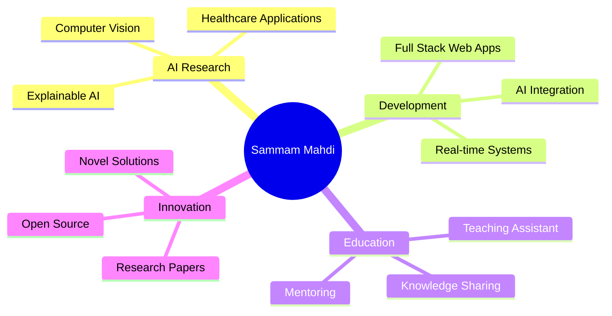

<div align="center">

# 👋 Hi, I'm Sammam Mahdi


[](https://linkedin.com/in/yourprofile)
[](mailto:sammam.mahdi@g.bracu.ac.bd)
[](https://github.com/yourusername)

</div>

---

## 🚀 About Me

```python
class SammamMahdi:
    def __init__(self):
        self.username = "sammam-mahdi"
        self.location = "Dhaka, Bangladesh"
        self.education = "BRAC University | CSE | CGPA: 3.90"
        self.role = "AI Researcher & Full Stack Developer"
        self.interests = ["Machine Learning", "Computer Vision", "XAI", "Healthcare AI"]
        
    def current_work(self):
        return [
            "🔬 Research in Explainable AI & Computer Vision",
            "👨‍🏫 Teaching Assistant @ BRAC University CSE",
            "🤖 Building AI-powered Healthcare Solutions",
            "📚 Publishing in IEEE Conferences & Journals"
        ]
```

---

## 💻 Tech Stack

### 🔥 Programming Languages
<p align="center">
  
</p>

<div align="center">
  
| Language | Proficiency |
|----------|-------------|
| Python |  |
| Java |  |
| JavaScript |  |
| C++ |  |

</div>

### 🌐 Web Development
<p align="center">
  
</p>

<div align="center">

| Technology | Proficiency |
|------------|-------------|
| MERN Stack |  |
| Vite |  |
| TypeScript |  |
| PHP |  |
| MySQL |  |
| Deployment |  |

</div>

### 🤖 AI/ML & Data Science
<p align="center">
  
</p>

**Core Expertise:**
- 🧠 Machine Learning & Deep Learning
- 👁️ Computer Vision & Object Detection
- 🔍 Explainable AI (XAI)
- 💬 Large Language Models (LLM) & Vision Language Models (VLM)
- 🏥 Healthcare AI Applications

**Libraries & Frameworks:**
- PyTorch | TensorFlow | Scikit-learn
- OpenCV | MediaPipe
- VSLAM | Object Detection

<div align="center">

| Specialization | Proficiency |
|----------------|-------------|
| Applied AI in Healthcare |  |
| Early Detection Systems |  |
| Stroke Diagnosis |  |
| Paper Writing (LaTeX) |  |

</div>

---

## 📊 GitHub Statistics

<div align="center">
  
  
</div>

<div align="center">
  
</div>

<div align="center">
  
</div>

---

## 📝 Research Publications

<details open>
<summary><b>🎓 IEEE Publications</b></summary>
<br>

### 📄 Journal Article
**"Optimizing Stroke Recognition With MediaPipe and Machine Learning: An Explainable AI Approach for Facial Landmark Analysis"**
- 📚 *IEEE Access, Vol. 13, pp. 32636-32660, 2025*
- 🔗 DOI: [10.1109/ACCESS.2025.3550577](https://doi.org/10.1109/ACCESS.2025.3550577)
- 🏆 Focus: Explainable AI, MediaPipe, Stroke Detection

### 📄 Conference Papers
**"Improved Photoplethysmography-Based Four-Stage Sleep Classification with Explainable AI-Driven Machine Learning"**
- 📚 *2024 IEEE ICEACE, Changchun, China*
- 🔗 DOI: [10.1109/ICEACE63551.2024.10898853](https://doi.org/10.1109/ICEACE63551.2024.10898853)

**"Machine Learning Approaches in Photoplethysmography-Based Sleep Stage Classification"**
- 📚 *2024 IEEE ICEACE, Changchun, China*
- 🔗 DOI: [10.1109/ICEACE63551.2024.10898858](https://doi.org/10.1109/ICEACE63551.2024.10898858)

</details>

---

## 🏆 Achievements & Awards

<div align="center">

| 🏅 Award | 🎯 Description |
|---------|---------------|
| 🌟 IEEE Published Author | 3 Publications in prestigious conferences & journals |
| 🎓 High Academic Performance | CGPA 3.90 at BRAC University |
| 🏆 HULT Prize Semi-Finalist | BRAC University |
| ⭐ Daily Star Awards | Recognition for Excellence |
| 👑 Duke of Edinburgh Award | Bronze |
| 📚 EDEXCEL High Achievers' Award | Multiple Years |
| 🎖️ Academia High Achievers' Award | Outstanding Performance |

</div>

---

## 💼 Experience

```typescript
const experience = {
    current: [
        {
            role: "Teaching Assistant",
            organization: "BRAC University CSE Department",
            period: "Spring 2025 - Present",
            focus: "Computer Science & Engineering"
        },
        {
            role: "AI Researcher",
            focus: "Machine Learning, Computer Vision, Healthcare AI",
            projects: ["Stroke Detection", "Sleep Classification", "XAI Systems"]
        }
    ],
    past: [
        {
            role: "Educator",
            experience: "3+ Years",
            subjects: "O-Level & A-Level Mathematics and Computer Science"
        },
        {
            role: "Team Contributor",
            organization: "BRACU Mongol Tori Control & Software Team",
            project: "University Rover Challenge"
        }
    ]
}
```

---

## 🎯 Current Focus

<div align="center">



</div>

---

## 🌱 What I'm Learning

<p align="center">
  
  
  
  
</p>

---

## 📫 Let's Connect!

<div align="center">

[](mailto:sammam.mahdi@g.bracu.ac.bd)
[](tel:+8801822926571)

**📍 Location:** House-80, Polashnagar, Mirpur-11, Dhaka-1216, Bangladesh

</div>

---

<div align="center">

### 💡 *"Turning data into insights, and insights into impact"*


</div>
